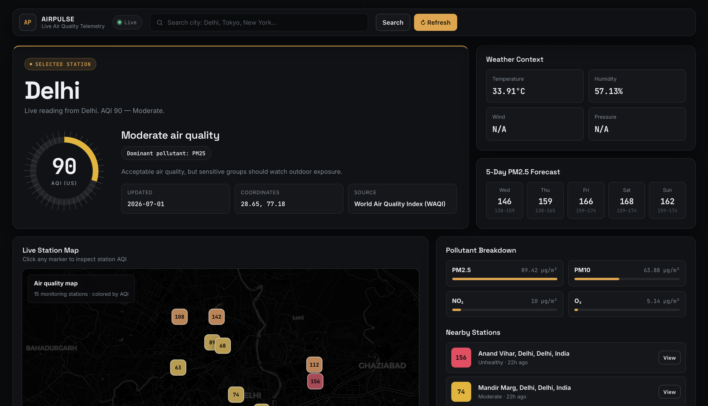
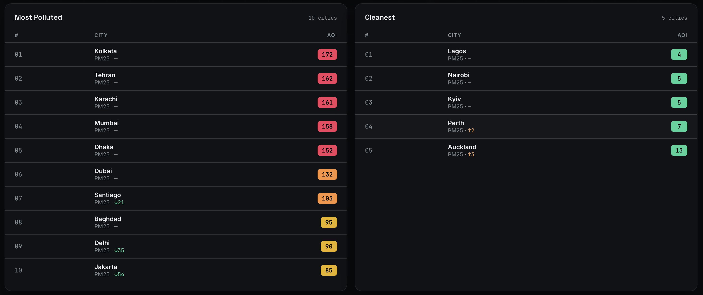

# AirPulse — Live Air Quality Intelligence

> A production-style data engineering pipeline that ingests real-time air quality readings from 83+ cities worldwide, transforms them through a dbt medallion architecture, detects anomalous pollution spikes via Z-score analysis, and serves everything through a FastAPI backend and live browser dashboard.

[](https://github.com/YOUR_USERNAME/airpulse/actions)


---

## Screenshots





---

## Architecture

```
WAQI API (83 cities)
       │
       ▼
waqi_client.py + db_loader.py          ← retry/backoff, idempotent upsert
       │
       ▼
PostgreSQL raw schema
  raw.waqi_readings · raw.waqi_forecasts
       │
       ▼
dbt transformations
  staging → intermediate → marts
  stg_waqi__readings
  int_city_daily_averages              ← daily agg + 7-day rolling avg
  fct_aqi_health_risk                  ← AQI scoring
  fct_anomaly_events                   ← Z-score spike detection
       │
       ▼
FastAPI  →  Browser Dashboard
           live map · trend · rankings · anomaly alerts
```

---

## What This Demonstrates

- **Pipeline design** — source → raw → staging → intermediate → mart, with clear separation of concerns at each layer
- **Idempotent ingestion** — `INSERT ... ON CONFLICT DO NOTHING` makes every run re-runnable without duplicates
- **dbt best practices** — sources, staging models, intermediate aggregations, mart models, schema tests, and a custom data test
- **Statistical anomaly detection** — Z-score window function over a 7-day rolling window flags pollution spikes automatically
- **REST API design** — FastAPI serves both the static dashboard and structured JSON endpoints consumed by the frontend
- **Resilient ingestion** — tenacity retry/backoff on every API call, plus a city-name fallback when bounding-box discovery returns zero stations

---

## Tech Stack

| Layer | Tool | Role |
|---|---|---|
| Data source | WAQI API | Live AQI readings + 5-day forecasts for 83 cities |
| Ingestion | Python 3.11 + requests + tenacity | Resilient HTTP client with retry/backoff |
| Orchestration | Apache Airflow 2.8 | DAG scheduling (optional; `run_pipeline.py` works standalone) |
| Storage | PostgreSQL 15 (local, no Docker) | Raw landing zone + dbt target |
| Transformation | dbt 1.7 | Medallion layers: staging → intermediate → marts |
| Backend | FastAPI 0.111 | REST API + serves the HTML dashboard |
| Frontend | HTML · Leaflet · Chart.js | Live map, trend chart, global rankings |
| CI | GitHub Actions | pytest + dbt compile + ruff lint on every push |

---

## Quick Start

**Requirements:** Python 3.11+, PostgreSQL 15 (Homebrew on Mac: `brew install postgresql@15`).

```bash
# 1. Clone and enter
git clone https://github.com/YOUR_USERNAME/airpulse.git
cd airpulse

# 2. One-time setup: venv, dependencies, PostgreSQL schema, Airflow
bash setup.sh

# 3. Copy env file and add your WAQI token
cp .env.example .env
# Get a free token at https://aqicn.org/data-platform/token/
# Edit .env: WAQI_TOKEN=your_token_here

# 4. Run the full pipeline once (ingest → validate → dbt run → dbt test)
source .venv/bin/activate
python run_pipeline.py

# 5. Start the API and open the dashboard
uvicorn api.main:app --reload --port 8000
# → http://localhost:8000
```

**Optional — schedule with Airflow:**
```bash
# The DAG at airflow/dags/air_quality_pipeline.py runs the pipeline on a cron schedule.
# Set AIRFLOW_HOME=.airflow and start the scheduler from your venv.
export AIRFLOW_HOME=$(pwd)/.airflow
airflow standalone   # opens http://localhost:8080 (admin / admin)
```

---

## Project Structure

```
airpulse/
├── .env.example                        ← Copy to .env, fill in WAQI_TOKEN
├── requirements.txt
├── run_pipeline.py                     ← Runs ingest → validate → dbt run → dbt test
├── setup.sh                            ← One-command local setup
│
├── ingestion/
│   ├── waqi_client.py                  ← WAQI API client (bounds + city-name fallback)
│   ├── openaq_client.py                ← OpenAQ v3 client (multi-source extension)
│   └── db_loader.py                    ← Idempotent PostgreSQL loader
│
├── api/
│   └── main.py                         ← FastAPI: /api/feed, /cities, /leaderboard, /anomaly
│
├── dashboard/
│   └── index.html                      ← Single-file browser dashboard
│
├── dbt/
│   ├── dbt_project.yml
│   ├── profiles.yml
│   └── models/
│       ├── staging/
│       │   ├── _sources.yml            ← raw schema source declarations
│       │   ├── stg_waqi__readings.sql  ← Clean + typecast + filter sentinel values
│       │   └── stg_all__readings.sql   ← UNION across all sources (extensible)
│       ├── intermediate/
│       │   └── int_city_daily_averages.sql  ← Daily agg + 7-day rolling avg
│       └── marts/
│           ├── fct_aqi_health_risk.sql      ← AQI categorisation + risk scoring
│           ├── fct_anomaly_events.sql       ← Z-score anomaly detection
│           └── schema.yml                   ← Column-level tests
│
├── airflow/
│   └── dags/
│       └── air_quality_pipeline.py     ← Airflow DAG (ingest → validate → dbt)
│
├── scripts/
│   └── init_db.sql                     ← PostgreSQL schema initialisation
│
├── tests/
│   └── test_ingestion.py               ← pytest: client, loader, AQI logic
│
├── docs/
│   ├── dashboard-main.png
│   └── dashboard-rankings.png
│
└── .github/
    └── workflows/
        └── ci.yml                      ← pytest + dbt compile + ruff on push
```

---

## dbt Model Lineage

```
raw.waqi_readings  ──►  stg_waqi__readings  ─┐
                                              ├─►  stg_all__readings  ──►  int_city_daily_averages
raw.openaq_readings ►  stg_openaq__readings  ─┘                                    │
                                                                                    ├──►  fct_aqi_health_risk
                                                                                    └──►  fct_anomaly_events
```

`stg_all__readings` is a UNION model — adding a new data source means writing one staging model and one line in the UNION. No downstream models change.

---

## Key Design Decisions

**Why a city-name fallback in the WAQI client?**
WAQI's `/map/bounds/` endpoint returns stations within a bounding box, but many cities (Mumbai, Bangalore, Kolkata) have sensors that report sentinel values (`"-"`) and get filtered out. The client falls back to `/feed/{city}/` which uses WAQI's own city index and returns the best available station — recovering coverage for ~20 additional cities.

**Why Z-score over a fixed threshold for anomaly detection?**
A fixed AQI threshold (e.g. > 150 = anomaly) doesn't account for baseline differences between cities — Kolkata's "normal" is Delhi's "good day". Z-score over a 7-day rolling window flags readings that are statistically unusual *for that city*, which is more meaningful.

**Why a UNION staging model?**
`stg_all__readings` decouples the source-specific cleaning logic from all downstream models. The intermediate and mart layers don't know or care where data came from. This is the standard pattern for multi-source pipelines and makes the OpenAQ extension trivial to activate.

---

## Data Quality

- **Idempotent loads** — `ON CONFLICT DO NOTHING` on `(station_id, reading_time)` unique key. Re-running the pipeline never creates duplicates.
- **Sentinel filtering** — WAQI returns `"-"` for offline sensors. Staging models cast AQI to integer and `WHERE aqi BETWEEN 0 AND 500` drops all sentinel values before any aggregation.
- **dbt schema tests** — `unique`, `not_null`, and `accepted_values` tests on every mart column. The pipeline fails at Step 4 if any test breaks.
- **Custom dbt test** — `assert_no_hazardous_data_without_anomaly_flag.sql` verifies that every city-day with AQI > 300 has a corresponding row in `fct_anomaly_events`. Catches regressions in the anomaly detection logic.
- **Validation step** — `run_pipeline.py` runs three SQL checks before invoking dbt: no null AQI values, no future timestamps, and at least one reading ingested in the last 2 hours.

---

## API Endpoints

| Method | Endpoint | Description |
|---|---|---|
| `GET` | `/` | Serves the browser dashboard |
| `GET` | `/api/cities` | Latest AQI snapshot for all monitored cities |
| `GET` | `/api/feed/{city}` | WAQI-shaped feed for one city (AQI, pollutants, forecast) |
| `GET` | `/api/stations/{city}` | Individual station readings for the map |
| `GET` | `/api/city/{city}` | 30-day daily history for trend chart |
| `GET` | `/api/leaderboard` | Top 10 most polluted + 5 cleanest cities |
| `GET` | `/api/anomaly/{city}` | Most recent anomaly event for a city (last 3 days) |
| `GET` | `/api/health` | Liveness check |

---

## Data Source

**WAQI — World Air Quality Index** ([aqicn.org](https://aqicn.org))
Free API key at [https://aqicn.org/data-platform/token/](https://aqicn.org/data-platform/token/). No credit card required.

---

*Built by Aj Ramineni · [aramineni@wpi.edu](mailto:aramineni@wpi.edu)*
